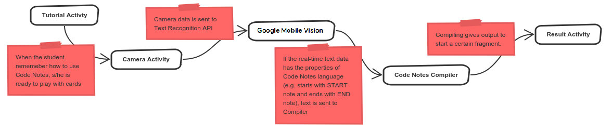

# CodeNotesApp

Programming has become an essential subject for today’s education curriculum and as a result, the importance of creating the right environments to teach is increasing. For such environments, featuring tangible tools enhances creativity and collaboration. However, due to their high prices, current tangible tools are not reachable by most of the students. We developed Code Notes as a low-cost, attainable and tangible tool aimed to motivate children to support programming education. Code Notes is comprised of an Android app and code-cardboards to teach the basic concepts in programming. We continue to develop the platform with insights gained from children. This paper shares the design phases of Code Notes and observations from our two-month programming project. We also presented some future concepts of Code Notes that offer an active and embodied interaction with the teaching material.

See the related article: [https://dl.acm.org/citation.cfm?id=3210791](https://dl.acm.org/citation.cfm?id=3210791)

My medium article on how to use Code Notes as teachers and developers: [https://medium.com/@sabuncuoglualpay/code-notes-low-cost-tangible-programming-cards-2f53964fa476](https://medium.com/@sabuncuoglualpay/code-notes-low-cost-tangible-programming-cards-2f53964fa476)

You can reach the printable cards: [Printables Folder](./docs/printable-tutorial/).

You can find JAVA and JS versions of the compiler from so you can play with the compiler : [Compiler Folder](./compiler) Or you can start with playing with Android App: [Android App](./codenotes-android) Android App uses Google Mobile Vision Text Recognition API. A simplified schematic of how it works:

