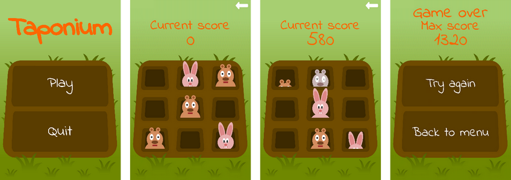

## Taponium
This is a simple reflex-oriented arcade game for Android. It was written with usage of Android SDK for Android 2.3.3 and newer. It uses Canvas to draw things on the display and it was (terribly) designed to be somehow resolution independent.

The game mechanics are very simple. You have to tap as many hamsters, randomly appearing on a board, as you can. For each tapped hamster you get 10 points. For each missed hamster you lose 100 points. Additionally, tapping a bunny causes a loss of 1000 points. Difficulty gradually rises over time, as everything gets surprisingly faster.

### Screenshots

### Credits
Taponium uses Indie Flower font created by Kimberly Geswein and published under Open Font License.
